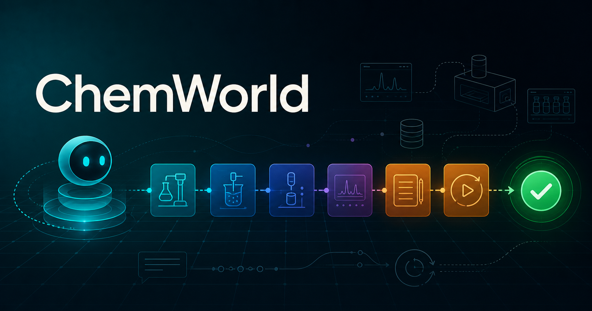

# ChemWorld



**A programmable virtual chemistry lab for students, experimental agents, and reproducible research.**

ChemWorld turns a chemical task into a stateful, typed laboratory: every accepted operation changes
the same virtual apparatus, instruments reveal public signals, resources are accounted for, and the
complete trace can be replayed. It is a software experiment environment—not guidance for physical
laboratory work.

[**Run the first experiment in Colab**](https://colab.research.google.com/github/Knitua/ChemWorld-Public/blob/v0.4.0/notebooks/01_first_experiment.ipynb)
· [Browse all notebooks](https://github.com/Knitua/ChemWorld-Public/tree/main/notebooks)
· [Open the documentation](https://knitua.github.io/ChemWorld-Public/)
· [Open the live Student Lab](https://chemworld-public-lab.onrender.com/student/)

## Choose your entry point

| I want to… | Start here | What runs |
| --- | --- | --- |
| Complete a guided experiment | [Open notebook 01 in Colab](https://colab.research.google.com/github/Knitua/ChemWorld-Public/blob/v0.4.0/notebooks/01_first_experiment.ipynb) | A deterministic Reaction-to-Assay experiment; no provider key |
| Continue through purification | [Open notebook 02 in Colab](https://colab.research.google.com/github/Knitua/ChemWorld-Public/blob/v0.4.0/notebooks/02_reaction_to_purification.ipynb) | Reaction, extraction, wash, drying and concentration |
| Change one world component | [Open notebook 03 in Colab](https://colab.research.google.com/github/Knitua/ChemWorld-Public/blob/v0.4.0/notebooks/03_controlled_world_change.ipynb) | The same public intervention across a controlled world fork |
| Operate the virtual apparatus by hand | [Open the live Student Lab](https://chemworld-public-lab.onrender.com/student/) | The real public Gym runtime in an animated browser workbench |
| Watch and compare agents | [Open the live Agent Observatory](https://chemworld-public-lab.onrender.com/agent/) | Provider-free scripted, random, DOE and Bayesian strategies |
| Connect my own agent | [Agent integration guide](https://knitua.github.io/ChemWorld-Public/agents/) | A small Python agent protocol with auditable traces |

## Live Lab

The Student Lab and Agent Observatory are not mock-ups. They create real in-memory ChemWorld Gym
sessions and execute the same public action, observation, validation, resource and replay contracts
used by Python agents.

[**Open the public Student Lab**](https://chemworld-public-lab.onrender.com/student/) ·
[**Open the Agent Observatory**](https://chemworld-public-lab.onrender.com/agent/)

The free public preview may take a short time to wake after an idle period. To run a private local
instance instead:

```bash
git clone https://github.com/Knitua/ChemWorld-Public.git
cd ChemWorld-Public
python -m pip install -e .
chemworld lab
```

Open `http://127.0.0.1:8876/student/` to operate the apparatus, or
`http://127.0.0.1:8876/agent/` to step through and compare provider-free policies. The local command
binds only to loopback by design. The deployable public service uses a separate, explicitly limited
mode so online visitors cannot enable providers or submit arbitrary code.

[Student Lab guide](https://knitua.github.io/ChemWorld-Public/student-lab/) ·
[Agent Observatory guide](https://knitua.github.io/ChemWorld-Public/agent-observatory/) ·
[Deployment guide](https://knitua.github.io/ChemWorld-Public/deployment/)

## What is public

- 15 typed experimental tasks spanning reaction, separation, crystallization, distillation, flow,
  electrochemistry, characterization, optimization and planning.
- Stateful material, apparatus and resource ledgers with atomic validation and recoverable failures.
- Public instruments and spectra, final assays, explicit termination and transaction-complete traces.
- Eight browser-visible provider-free policies, including scripted chemistry, random and Latin
  hypercube designs, greedy search, Gaussian-process BO, safety-constrained BO and offline LLM-style
  replay.
- Three executed tutorial notebooks whose retained outputs are deterministic demonstrations rather
  than benchmark claims or optimized laboratory procedures.

## Install and integrate

ChemWorld supports Python 3.11 and 3.12.

```bash
python -m pip install -e ".[notebooks]"
python examples/demo_manual_event_sequence.py
```

Agents can implement the small `BaseAgent` protocol and run through `run_agent`. Online provider
adapters are opt-in Python workflows; they are deliberately not exposed by the public Lab service.
See the [agent guide](https://knitua.github.io/ChemWorld-Public/agents/) for offline, DeepSeek and Codex
subscription examples and their provenance requirements.

## Reproducibility and scope

Release `v0.4.0` adds the provider-free Student Lab and Agent Observatory to the stable public
runtime. The software, schemas, tests, protocols, sanitized evidence and deterministic release
manifest remain in this repository so the attractive entry points do not replace scientific audit.

- [Documentation](https://knitua.github.io/ChemWorld-Public/)
- [Evidence map](evidence/README.md)
- [Public protocols](protocols/README.md)
- [Release manifest](release/manifest.json)
- [Limitations and scientific boundary](https://knitua.github.io/ChemWorld-Public/limitations/)

ChemWorld is released under the [MIT License](LICENSE). If you use a frozen release in research,
cite the repository metadata in [`CITATION.cff`](CITATION.cff) and record the release tag, task,
world split, seed, action trace and provider provenance when applicable.
