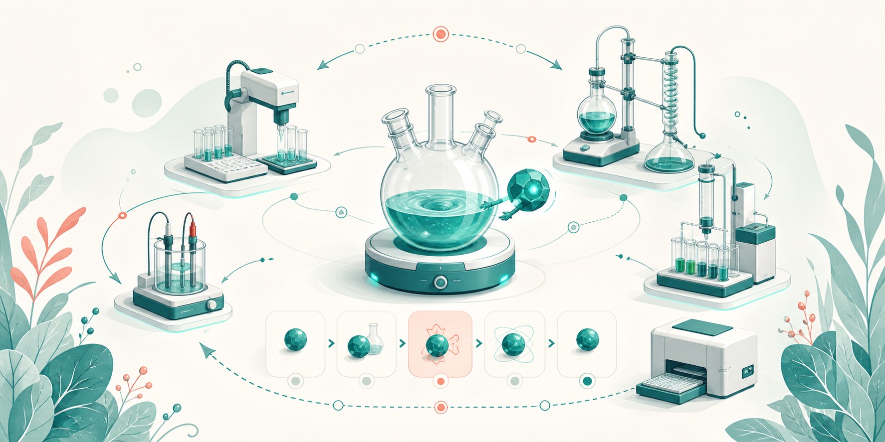
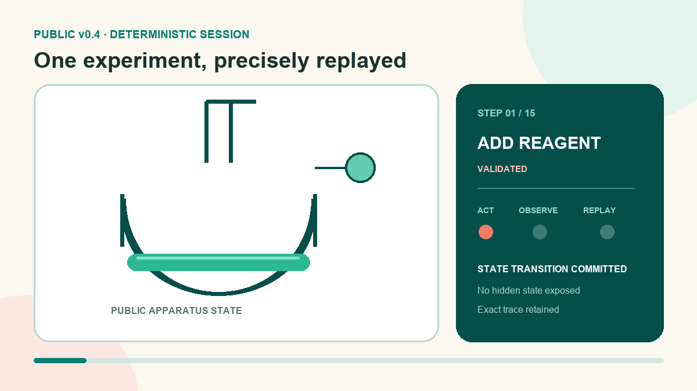
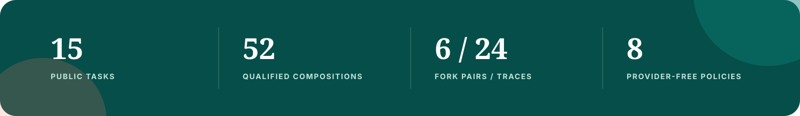
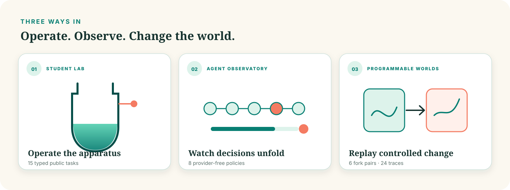

<div align="center">

**English** · [简体中文](README.zh-CN.md)

<sub><strong>Built by researchers at Tsinghua University 🇨🇳</strong></sub>

# We didn’t just imagine a virtual chemistry lab.<br>We built one agents can actually experiment in. 🧪

ChemWorld lets agents act, observe, fail, recover—and replay every accepted step exactly.

[](https://chemworld-public-lab.onrender.com/student/)

[**🚀 Try the Live Lab**](https://chemworld-public-lab.onrender.com/student/) · [**🤖 Watch Agents**](https://chemworld-public-lab.onrender.com/agent/) · [**📓 Run in Colab**](https://colab.research.google.com/github/Knitua/ChemWorld-Public/blob/v0.4.0/notebooks/01_first_experiment.ipynb) · [**📚 Read the Research**](https://knitua.github.io/ChemWorld-Public/)

</div>

## One experiment, from action to assay



This 7.2-second loop is generated from a frozen Public v0.4 lifecycle—not a staged UI recording. It follows legal material additions, process operations, instrument observations, termination and final assay while exposing only public state.

## 🔬 What we actually built

| Programmable chemical worlds | Complete agent experiments | Controlled forks and exact replay |
| --- | --- | --- |
| Typed tasks compose kinetics, phases, apparatus, instruments, constraints and budgets into stateful worlds. | An agent can design, operate, measure, fail, recover, terminate and close an experiment with a final assay. | Change one registered private law, keep the public contract fixed, then audit matched traces step by step. |



The browser Observatory runs eight built-in provider-free policies. Your own policy or model connects through the small Python agent protocol, where decisions, tool use, resources and provenance can be retained in the trajectory.

## 🌍 Why ChemWorld

| A static benchmark asks… | ChemWorld asks… |
| --- | --- |
| Can the model answer from a fixed prompt? | What evidence does the agent choose to acquire? |
| Is the final answer correct? | Can it operate legally, learn from failure and finish the experimental lifecycle? |
| Does performance survive new examples? | Does strategy survive a controlled change in the world’s causal rules? |



## 📚 Explore the research

| Goal | Page |
| --- | --- |
| Understand the research thesis | [Why ChemWorld](https://knitua.github.io/ChemWorld-Public/vision/) |
| Read the normative system model | [System Model](https://knitua.github.io/ChemWorld-Public/architecture/) |
| See how causal worlds change | [Causal Worlds](https://knitua.github.io/ChemWorld-Public/causal-worlds/) |
| Explore Showcase Worlds | [Worlds](https://knitua.github.io/ChemWorld-Public/worlds/) |
| Inspect Confirmatory Benchmark Tasks | [Confirmatory Tasks](https://knitua.github.io/ChemWorld-Public/confirmatory-tasks/) |
| Choose an agent interaction level | [Agent Tracks](https://knitua.github.io/ChemWorld-Public/agent-tracks/) |
| Build an agent | [Getting Started](https://knitua.github.io/ChemWorld-Public/getting-started/) |
| Design an evaluation | [Benchmark Design](https://knitua.github.io/ChemWorld-Public/benchmark-design/) |
| Understand the real-world roadmap | [Real-world Bridge](https://knitua.github.io/ChemWorld-Public/real-world-bridge/) |

## Run locally

```bash
git clone https://github.com/Knitua/ChemWorld-Public.git
cd ChemWorld-Public
python -m pip install -e .
chemworld lab
```

Then open `http://127.0.0.1:8876/student/`. Python 3.11 and 3.12 are supported.

## Team, citation and scope

ChemWorld is built by **Jiangjie Qiu, Yijun Li and Xiaonan Wang** at the Beijing Key Laboratory of Artificial Intelligence for Advanced Chemical Engineering Materials, State Key Laboratory of Chemical Engineering and Low-Carbon Technology, Department of Chemical Engineering, Tsinghua University.

Use the machine-readable metadata in [`CITATION.cff`](CITATION.cff) and record the release tag, task, world split, seed, trace and provider provenance when applicable. The code is released under the [MIT License](LICENSE).

**Scientific boundary.** ChemWorld is a bounded software-model environment for experimental-interaction research. Its virtual quantities, policies and rankings are not physical-laboratory instructions, validated chemical recommendations or evidence of real-world transfer.
