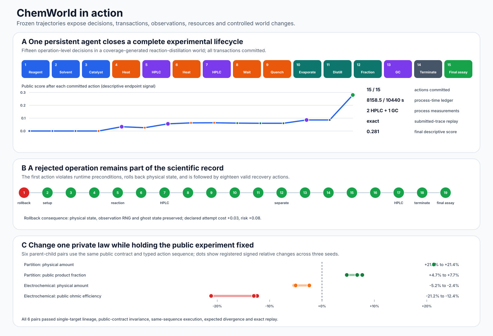

# ChemWorld


**Programmable chemical worlds for controlled, replayable agent experimentation.**

[Documentation](https://sunyrain.github.io/ChemWorld-Public/) ·
[First experiment](https://colab.research.google.com/github/sunyrain/ChemWorld-Public/blob/v0.3.0/notebooks/01_first_experiment.ipynb) ·
[Local Lab](#local-lab-no-model-required) ·
[Connect an agent](docs/agents.md) ·
[Evidence](docs/evidence.md) ·
[Release verification](scripts/verify_release.py)

ChemWorld gives experimental agents a typed laboratory interface rather than an answer-only benchmark. An agent inspects a public task contract, commits physically constrained operations, uses instruments, spends explicit resources, encounters recoverable failures and leaves a transaction-complete trace that can replay exactly.

[Explore every action and observation in the interactive documentation →](https://sunyrain.github.io/ChemWorld-Public/one-experiment/)

## Start in five minutes

ChemWorld supports Python 3.11 and 3.12.

```bash
git clone https://github.com/sunyrain/ChemWorld-Public.git
cd ChemWorld-Public
python -m pip install -e ".[notebooks]"
python examples/demo_manual_event_sequence.py
```

The tutorials require no provider key:

| Notebook | What you do | Run |
| --- | --- | --- |
| `01_first_experiment` | Inspect a Reaction-to-Assay contract, validate actions, use HPLC and complete a final assay | [Open in Colab](https://colab.research.google.com/github/sunyrain/ChemWorld-Public/blob/v0.3.0/notebooks/01_first_experiment.ipynb) |
| `02_reaction_to_purification` | Continue through extraction, wash, drying and concentration | [Open in Colab](https://colab.research.google.com/github/sunyrain/ChemWorld-Public/blob/v0.3.0/notebooks/02_reaction_to_purification.ipynb) |
| `03_controlled_world_change` | Hold the public experiment fixed while one registered world component changes | [Open in Colab](https://colab.research.google.com/github/sunyrain/ChemWorld-Public/blob/v0.3.0/notebooks/03_controlled_world_change.ipynb) |

Checked-in notebook outputs are deterministic public demonstrations, not benchmark results or optimized laboratory procedures.

## Local Lab (no model required)

Launch the animated browser workbench after installing the package:

```bash
chemworld lab
```

The Lab runs locally on `127.0.0.1`, uses the same typed action schemas and transactional Gym
runtime as normal experiments, and requires no model, provider account or API key. It has two
linked workspaces:

- **Student Lab** (`/student/`) for composing and validating operations by hand.
- **Agent Observatory** (`/agent/`) for stepping through provider-free policies, inspecting their
  public decision context, spectra, transaction receipts and resource accounting, and making
  same-task, same-seed exploratory comparisons.

Both views visualize only committed public effects and observations; neither infers hidden
composition. Online provider adapters remain an explicit Python workflow so credentials, model
identity and resource limits cannot be hidden behind a one-click browser action.

## Bring your own agent

The public runner accepts any Python object implementing the small ChemWorld agent protocol. Start
with an offline agent, then opt into the audited DeepSeek or Codex subscription adapters only when
you need a live model. Provider credentials stay in environment variables and live runs record
resource and model provenance separately from environment score.

[Follow the custom and live-agent guide →](docs/agents.md)

## What ChemWorld exposes

- **Composable worlds:** reaction, thermal, phase, separation, crystallization, distillation, flow, electrochemical and observation components behind one compatibility-checked contract.
- **Agent-facing operations:** public task prompts, parameter schemas, action validation, instruments, observations, failure reasons, resources and termination.
- **Transactional execution:** accepted actions commit atomically; failed runtime preconditions roll back physical state while retaining registered attempt consequences.
- **Controlled world forks:** experiment authors can change one registered private component while holding the public contract and typed action sequence fixed.
- **Exact replay:** submitted traces—including rolled-back requests—remain reconstructable and auditable.

## Frozen evidence

Version 0.4.0 adds the provider-free Student Lab and Agent Observatory on top of the stable runtime.
The local Lab is an interaction surface, not new benchmark evidence; the frozen v0.3.0 runtime
evidence remains intact:



- 64/64 registered task–world units and 1,786/1,786 reference recipes completed.
- 52/52 coverage-generated compositions completed, including 8/8 non-reference reaction–distillation worlds.
- Eight deterministic lifecycles checked all 89 submitted actions: 88 committed and one planned rollback.
- Six controlled parent–child world pairs produced 24 provider-free traces.
- One independent agent completed a 15-action public-instrument lifecycle.

These are finite software-model qualification results. They do not establish universal chemical fidelity, general agent intelligence or transfer to a physical laboratory.

## Verify offline

```bash
python -m pip install -e ".[dev]"
python scripts/verify_release.py
python scripts/build_readme_visuals.py --check
python -m pytest -q
```

The release verifier checks the exact Git-tracked file set and hashes, evidence sanitization receipts, denominators, failures, replay outcomes and the clean public-history boundary.

## Release boundary

This repository contains the stable runtime, public protocols, final sanitized evidence, deterministic tutorial outputs, documentation, examples and focused tests. It excludes manuscript files and assets, planning notes, development matrices, draft/interim/pilot results, raw provider responses, provider session identifiers, private evaluator configuration, credentials and all unpublished post-freeze development artifacts.

See [CITATION.cff](CITATION.cff) for citation metadata. The software is available under the [MIT License](LICENSE).
